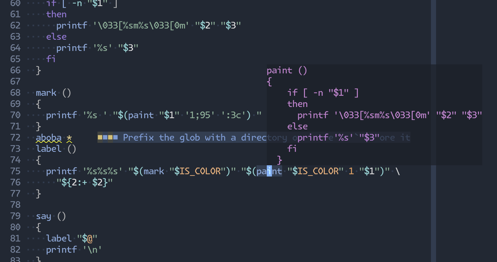

# kosh.nvim

This repository hosts [Koshka Shell](https://github.com/fennec-support/kosh)
tooling for Neovim 0.11+.

Currently that includes:
- Linter
- LSP/Symbols
- Formatter

| kosh lsp in action. |
| - |
|  |

### Installation

Make sure you have:
- `kosh` on `PATH`. See the
  [Koshka install instructions](https://github.com/fennec-support/kosh).
- Optionally, tree-sitter parsers for shell highlighting.

With [lazy.nvim](https://github.com/folke/lazy.nvim):
```lua
{ "fennec-support/kosh.nvim", lazy = false, opts = {} }
```

Don't forget to disable `bashls`.

### Options

Defaults:
```lua
require("kosh").setup({
  format_on_save = false,
  -- Filetypes appended to the built-in list.
  additional_filetypes = {},
})
```

### Documentation

[RTFM](doc/kosh.txt).
